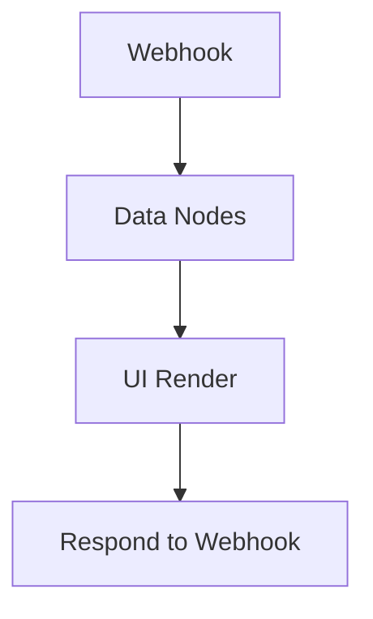

# n8n-nodes-ui-render

Turn your n8n data into clean, good-looking HTML reports (tables, charts, timelines, and even a chat-style UI).

This node sits between your data workflow and `Respond to Webhook`, so you can ship a ready-to-view page with one step.


## What it renders
Vous pouvez générer une page HTML “prête à partager” depuis vos données n8n. Selon le `Template Type`, le rendu peut être :

- `table` : tableau responsive
- `list` : liste en cartes
- `chart` : `bar`, `line`, `pie`, + `donut` et `polar`
- `sectionText` : une section “titre + paragraphe” (avec placeholders)
- `chat` : une UI de chat à partir d’un tableau de messages

## Presets (le look & la mise en page)
Les presets ne changent pas juste les couleurs : ils ajustent aussi l’espacement, la typographie et parfois la layout.

- `ExecutiveDashboard` : neutre, clean, “rapport business”
- `SalesReport` : header centré et style plus “sérieux”
- `OpsTable` : si tu mets plusieurs blocs `chart` à la suite, ils sont regroupés en grille
- `ActivityFeed` : transforme les blocs `list` en timeline

### Tips pour un rendu “grey / neutre”
- Garde `Theme = light` et évite de surcharger les couleurs : laisse le preset faire le travail.
- Mets `Layout Density = comfortable` pour éviter les cartes trop proches.
- Laisse `Style — Accent Color / Background Color / Text Color` vides si tu veux un rendu cohérent “preset-first”.

## Quick setup n8n (Webhook -> UI Render -> Respond to Webhook)
Le flow standard :



Ensuite, dans `Respond to Webhook` :
- Body : `{{$json.html}}`
- Header : `Content-Type: text/html; charset=utf-8`

## Placeholders (rapides à utiliser)
Dans les champs texte (titre, subtitle, sectionText, etc.) :

- `{{item.field}}`
- `{{meta.generatedAt}}`
- `{{stats.count}}`

## Charts : mapping (donut / polar inclus)
Pour n’importe quel type de chart (`bar`, `donut`, `polar`, etc.), tu configures :
- Labels mode : `field` ou `array`
- Values mode : `field` ou `array`

Puis :
- Labels : `chartLabelField` ou `chartLabelsArray`
- Values : `chartValueField` ou `chartValuesArray`

## Multi-block (mode “dashboard builder”)
Quand `Page Composition Mode = Multi Blocks`, tu empiles plusieurs blocs sur la même page.

- Types de blocs : `table`, `list`, `chart`, `text`
- L’ordre que tu mets dans `Blocks` est l’ordre réel à l’écran

Et pour `OpsTable` :
- si tu mets plusieurs blocs `chart` qui se suivent, ils partent dans une **grille** (pratique pour un “dashboard ops”).

## Chat template
Pour `Template Type = chat`, le node lit un tableau de messages dans ton item.

Par défaut, il attend :
- `messages` = array
- chaque message : `role`, `content`, et un `timestamp` optionnel

Tu peux renommer les champs via :
- `Chat — Messages Field`
- `Chat — Role Field`
- `Chat — Content Field`
- `Chat — Timestamp Field`

### Exemple de payload chat
```json
{
  "messages": [
    { "role": "user", "content": "Hello !", "timestamp": "2026-03-20 08:33" },
    { "role": "assistant", "content": "Hi ! Voici le dashboard ops.", "timestamp": "2026-03-20 08:34" }
  ]
}
```

## Safety
- Par défaut, les valeurs dynamiques sont échappées HTML (plus safe).
- Si tu actives `Advanced — Allow Unsafe HTML`, tu autorises l’injection HTML brute. À utiliser seulement avec des contenus de confiance.

## License
MIT
