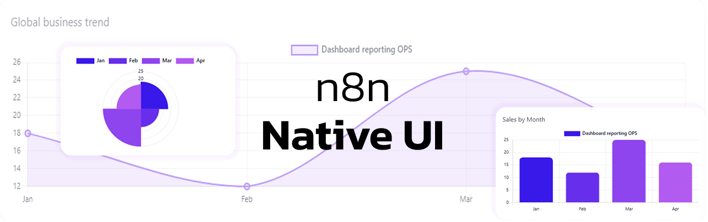
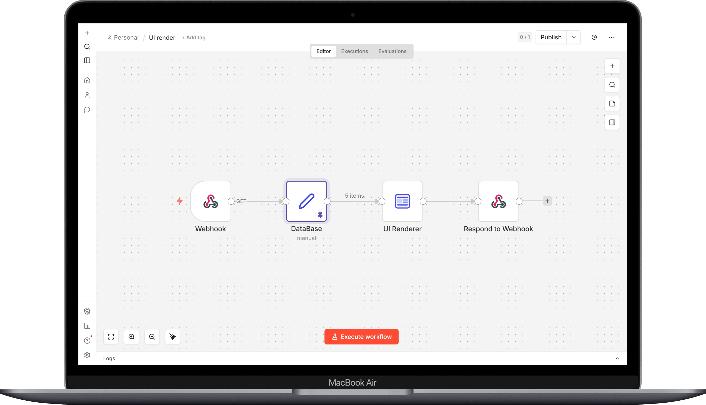

# UI Render


# n8n-nodes-ui-render

Turn your n8n data into clean, good-looking HTML reports (tables, charts, timelines, and even a chat-style UI).

This node sits between your data workflow and `Respond to Webhook`, so you can ship a ready-to-view page with one step.


## What it renders
You can generate share-ready HTML pages from your n8n workflow data. Depending on the `Template Type`, the renderer can output:

- `table` — responsive HTML table
- `list` — card-based list
- `chart` — `bar`, `line`, `pie`, plus `donut` and `polar`
- `sectionText` — a “title + paragraph” section (supports placeholders)
- `chat` — a chat UI rendered from an array of messages

## Presets (global look & layout)
Presets don’t only change colors. They also tune global spacing, typography, and a few layout behaviors:

- `ExecutiveDashboard` — clean, neutral “business report” look
- `SalesReport` — centered header with a more serious feel
- `OpsTable` — consecutive `chart` blocks are grouped into a responsive grid
- `ActivityFeed` — `list` blocks become a timeline layout

### Tips for a neutral / grey-first layout
- Keep `Theme = light` and avoid heavy overrides—let the preset lead the look.
- Set `Layout Density = comfortable` to prevent cards from feeling cramped.
- Leave `Style — Accent Color / Background Color / Text Color` empty to keep a consistent preset-first theme.

## Quick setup n8n (Webhook -> UI Render -> Respond to Webhook)
The standard flow is:



Then, in `Respond to Webhook`:
- Body: `{{$json.html}}`
- Header: `Content-Type: text/html; charset=utf-8`

## Placeholders (quick to use)
Use them in text fields (title, subtitle, sectionText, etc.):

- `{{item.field}}`
- `{{meta.generatedAt}}`
- `{{stats.count}}`

## Charts: mapping (donut / polar included)
For any chart type (`bar`, `donut`, `polar`, etc.), configure:
- Labels mode: `field` or `array`
- Values mode: `field` or `array`

Then set:
- Labels: `chartLabelField` or `chartLabelsArray`
- Values: `chartValueField` or `chartValuesArray`

## Multi-block layout (dashboard builder mode)
When `Page Composition Mode = Multi Blocks`, you can stack multiple blocks on the same page:

- Block types: `table`, `list`, `chart`, `text`
- The order you define in `Blocks` is the order users see on the page

Preset behavior:
- `OpsTable`: if you place consecutive `chart` blocks, they are grouped into a **responsive grid** (great for an “ops dashboard”).

## Chat template
For `Template Type = chat`, the node reads an array of messages from your input item.

By default, it expects:
- `messages` = array
- each message has: `role`, `content`, and an optional `timestamp`

You can rename those fields via:
- `Chat — Messages Field`
- `Chat — Role Field`
- `Chat — Content Field`
- `Chat — Timestamp Field`

### Example chat payload
```json
{
  "messages": [
    { "role": "user", "content": "Hello!", "timestamp": "2026-03-20 08:33" },
    { "role": "assistant", "content": "Hi! Here is the ops dashboard.", "timestamp": "2026-03-20 08:34" }
  ]
}
```

## Safety
- Dynamic values are HTML-escaped by default (safer for untrusted data).
- If you enable `Advanced — Allow Unsafe HTML`, you allow raw HTML injection. Only use it with trusted content.

## License
MIT — see [LICENSE.md](LICENSE.md)
