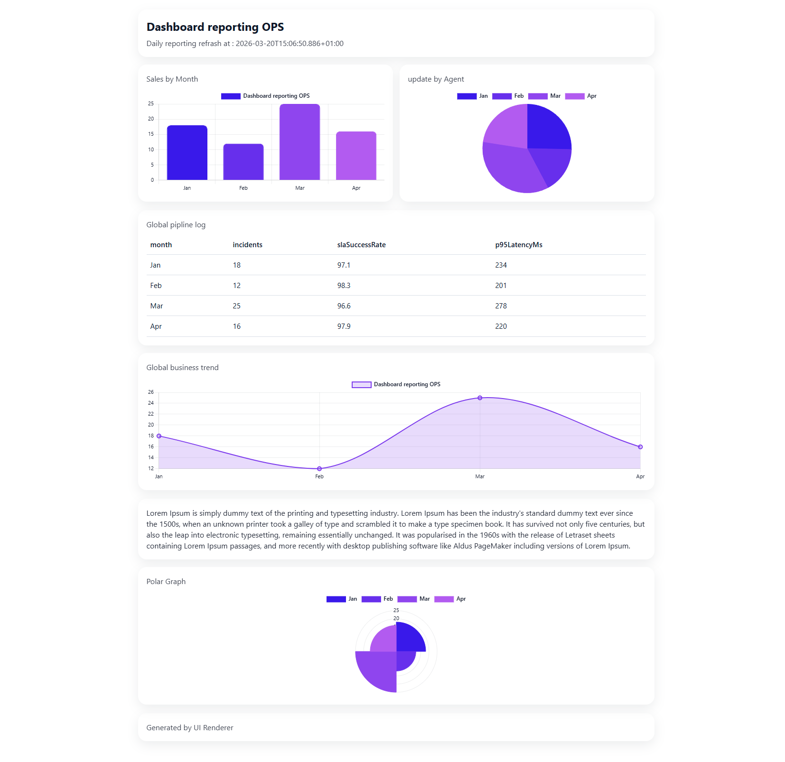

# n8n-nodes-ui-render

Turn your n8n data into clean, good-looking **HTML** reports (tables, charts, timelines, and a **chat-style** transcript UI).  
Use it between your data nodes and **Respond to Webhook** to return a full HTML page in one step.

## Installation

### Community Nodes (recommended)

1. In n8n: **Settings → Community Nodes**.
2. **Install**: enter the package name `n8n-nodes-ui-render` and install.
3. Reload n8n if prompted.

### Manual install (self-hosted)

From the same directory as your n8n installation (or your custom nodes setup):

```bash
npm install n8n-nodes-ui-render
```

Restart n8n after installation.

> **npm / GitHub releases**  
> Until a version is published to npm, **Community Nodes** may not resolve the package. Maintainers: configure Trusted Publishing (or `NPM_TOKEN`) as described in [`.github/workflows/publish.yml`](.github/workflows/publish.yml), then run **`npm run release`** locally to bump, tag, and trigger the npm publish workflow.

## What it renders



Depending on **Template Type**:

- `table` — responsive HTML table  
- `list` — card list (timeline layout under **Activity Feed** preset)  
- `chart` — `bar`, `line`, `pie`, `donut`, `polar` (Chart.js)  
- `sectionText` — title + paragraph (supports placeholders)  
- `chat` — chat UI from a **messages** array on your item  
- `LLM Chat Widget (webhook)` — embed / widget-oriented template (see node options)

## Input data: one item = one row (important)

For **table**, **list**, and **chart** (field mode), the node uses **each input item’s `json`** as one data row (or one chart point).  
If you have a single item like `{ "rows": [ ... ] }`, add a **Code** node to output one item per row (snippet in [examples/README.md](examples/README.md)).

Ready-to-copy samples live under **[examples/](examples/)** (table, chart, list, section text, chat).

### Table — one row (one item)

[`examples/payload-table-row.json`](examples/payload-table-row.json)

```json
{
	"deal": "Acme Corp",
	"owner": "Alex",
	"stage": "Negotiation",
	"amount": 12000
}
```

### Chart — field mode, multiple points = multiple items

Use one item per point, or expand from [`examples/payload-chart-rows-bulk.json`](examples/payload-chart-rows-bulk.json). Single point example: [`examples/payload-chart-row.json`](examples/payload-chart-row.json).

### Chart — array mode (labels/values in the node)

When **Labels mode** / **Values mode** are set to **array**, paste JSON **strings** into the node fields (see [`examples/payload-chart-donut-array.json`](examples/payload-chart-donut-array.json)).

### List — one row (one item)

[`examples/payload-list-row.json`](examples/payload-list-row.json)

### Chat template

[`examples/payload-chat.json`](examples/payload-chat.json)

```json
{
	"messages": [
		{ "role": "user", "content": "Hello!", "timestamp": "2026-03-20 08:33" },
		{
			"role": "assistant",
			"content": "Hi! Here is the ops dashboard.",
			"timestamp": "2026-03-20 08:34"
		}
	]
}
```

Field renames: **Chat — Messages / Role / Content / Timestamp** in the node.

### Importable workflow

GitHub Markdown cannot add a real “Copy to clipboard” button. To try quickly:

1. **Manual Trigger** → **Set** (paste JSON from `examples/`) → **UI Render** → **Respond to Webhook**.  
2. Or use a **Code** node with the expand snippet from [examples/README.md](examples/README.md).

You can also **duplicate** an existing workflow and replace the body of **Set** with the sample files above.

## Quick setup: Webhook → UI Render → Respond to Webhook

1. Build your data, then **UI Render**.  
2. In **Respond to Webhook**:  
   - **Body**: `{{$json.html}}`  
   - **Header**: `Content-Type: text/html; charset=utf-8`

## Placeholders (`{{ … }}`) — not Handlebars, not n8n expressions *inside* the template

Inside **UI Render** text fields (title, subtitle, section text, etc.), the node runs a **small built-in resolver**:

- **`{{item.some.path}}`** — value from the **first** input item (dot path).  
- **`{{meta.generatedAt}}`** — render metadata (see below).  
- **`{{stats.count}}`** — number of input items used for this render.

This is **not** Handlebars and **does not** evaluate arbitrary n8n expressions like `{{ $json.x }}` *inside* those strings.  
If you need n8n expressions, use them **in the parameter itself** in the n8n UI (n8n evaluates the parameter **before** the node runs); the UI Render placeholders are only for the `item` / `meta` / `stats` prefixes above.

### Available `meta` and `stats`

| Object | Keys | Description |
|--------|------|-------------|
| `meta` | `generatedAt` | ISO timestamp when the HTML was generated. |
| `stats` | `count` | Count of input items in the current render context. |

## Presets (global look & layout)

- **ExecutiveDashboard** — neutral business report.  
- **SalesReport** — centered header, formal tone.  
- **OpsTable** — consecutive **chart** blocks can form a **responsive grid**.  
- **ActivityFeed** — **list** blocks use a **timeline** layout.

### Tips for a neutral layout

- Prefer **Theme = light** unless you’ve tuned custom colors.  
- **Layout density = comfortable** avoids cramped cards.  
- Leave accent / background / text color empty to rely on the preset.

## Charts (donut / polar included)

- **Labels**: mode `field` or `array`  
- **Values**: mode `field` or `array`  
- Map **field** names or paste **array** JSON strings in the node fields.

## Multi-block mode

With **Page composition = Multi blocks**, stack **table / list / chart / text** blocks in order (block type **Text** maps to section-style content). **OpsTable** groups consecutive charts in a grid.

## Floating chat widget (direct webhook)

Enable **Chat Widget (direct webhook)** in the node. The page **POST**s JSON to your public webhook: `sessionId`, `message`, `chatInput`.

## Local development

Clone the repo, then:

```bash
npm install
npm run build
```

Link into your n8n environment (from this package directory):

```bash
npm link
# in the n8n installation directory (or as per n8n docs for custom nodes):
npm link n8n-nodes-ui-render
```

Restart n8n after each **build** so it picks up `dist/`.  
Optional: `npm run dev` / `n8n-node dev` if you use the n8n node CLI in watch mode.

## Roadmap (ideas)

- **Dark mode polish** — first-class theme QA (today: light is the safest default).  
- **Export PDF** — optional pipeline (e.g. headless Chromium) from the generated HTML.  
- **More chart types** — area, mixed axes, radar, etc.  
- **More preset screenshots** — gallery in the README.

## Safety

- Values are **HTML-escaped** by default.  
- **Advanced — Allow unsafe HTML** allows raw HTML; use only with trusted content.

## License

MIT — [LICENSE.md](LICENSE.md)
